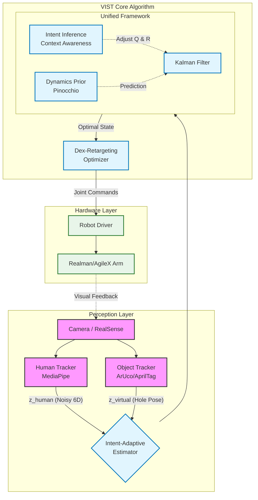

# VIST: Vision-based Intent-aware State Teleoperation
> **A Unified Probabilistic State Estimation Framework for Contact-Rich Manipulation**

[](https://opensource.org/licenses/MIT)
[](https://www.python.org/)
[]()

**VIST** 是一个面向低成本精密装配任务的**统一状态估计框架**。

针对纯视觉遥操作（Vision-based Teleoperation）中长期存在的“三难困境”——**高频输入噪声（Jitter）**、**力/触觉反馈缺失（Lack of Haptics）**以及**7DOF冗余解析的不确定性（Redundancy Ambiguity）**，本项目并未采用堆砌算法模块（Filter + IK + Potential Fields）的传统路径，而是提出了一种基于**第一性原理**的解决方案：

我们将遥操作过程重新建模为一个**意图感知的贝叶斯状态估计问题（Intent-Aware Bayesian State Estimation）**。通过在状态观测器中动态注入环境约束和动力学先验，VIST 在不依赖昂贵力传感器和主从机械臂的情况下，仅凭消费级相机即可实现**亚毫米级**的精密装配操作。

---

## 🧠 核心理念 (Core Philosophy)

> **"State Estimation is Implicit Control."**

VIST 的核心创新在于视角的转换：我们不直接“控制”机器人，而是通过融合多源信息（人类指令、视觉几何约束、动力学先验）来“估计”机器人的最优状态。

在这个框架下，三个看似独立的工程难题被统一为一个数学问题：
1.  **去噪** $\rightarrow$ 权衡观测置信度与预测置信度。
2.  **虚拟力反馈** $\rightarrow$ 引入高置信度的“虚拟观测值（Virtual Measurements）”。
3.  **7DOF肘部约束** $\rightarrow$ 冗余自由度的隐状态推断（Latent State Inference）。

---

## ✨ 关键特性 (Key Features)

### 1. 🛡️ 统一的概率状态估计框架 (Unified State Estimation Framework)
摒弃了“先滤波后IK”的解耦架构。VIST 设计了一个高维状态观测器，同时处理末端位姿和关节空间状态。
*   **输入**：嘈杂的人类手部位姿（Human Input）+ 环境几何特征（Visual Context）。
*   **输出**：符合物理规律、平滑且满足任务约束的机器人全状态（Joint Positions & Velocities）。

### 2. 🦾 隐式冗余解析与肘部约束 (Implicit Redundancy Resolution)
针对 7DOF 机械臂在纯视觉映射中常见的**肘部姿态奇异与乱晃**问题：
*   **传统方法**：需要复杂的零空间（Null-space）投影或额外的肘部追踪器。
*   **VIST方法**：在卡尔曼滤波的预测步（Prediction Step）引入**最小能量动力学先验**。当人类输入缺乏肘部约束信息（观测缺失）时，估计器利用先验模型自动推断出最自然的肘部运动轨迹，实现鲁棒的 7DOF 控制。

### 3. 🧲 基于虚拟观测的隐式力引导 (Implicit Haptic Guidance)
解决纯视觉方案缺乏力反馈导致的“过冲”和“对准难”问题：
*   系统将视觉识别到的装配轴线（如孔位中心）建模为**虚拟观测值（Virtual Measurement）**。
*   **意图感知调度**：当识别到装配意图时，动态降低虚拟观测的协方差（$R_{virtual} \to 0$）。
*   **效果**：数学上的最优估计产生物理上的“吸附力”，将操作者的手自动引导至正确的装配路径，形成**视觉-触觉闭环（Visual-Haptic Loop）**。

### 4. 🧠 意图调制的协方差调度 (Context-Aware Covariance Scheduling)
系统不是静态的，而是具有**自适应性**。通过实时计算任务上下文（距离、速度、对准误差），动态调整卡尔曼增益 $K$：
*   **Free Motion Phase**: 信任人类输入 ($R_{human} \downarrow$)，保证高动态响应。
*   **Fine Alignment Phase**: 信任预测模型与环境约束 ($R_{human} \uparrow, R_{virtual} \downarrow$)，消除生理性抖动并锁定操作轴线。

---

## 📝 数学表述 (Mathematical Formulation)

我们将系统建模为带有意图参数 $\alpha$ 的时变卡尔曼滤波过程：

### 状态方程 (State Transition)
$$ x_{k} = F x_{k-1} + w_k, \quad w_k \sim \mathcal{N}(0, Q_{dynamics}) $$
*   此处 $Q_{dynamics}$ 包含了对肘部运动的能量约束，实现了自动的冗余解析。

### 观测方程 (Augmented Measurement)
$$
Z_k = \begin{bmatrix} z_{human} \\ z_{virtual} \end{bmatrix}, \quad
R_k(\alpha) = \begin{bmatrix} R_{human}(\alpha) & 0 \\ 0 & R_{virtual}(\alpha) \end{bmatrix}
$$

*   **$z_{human}$**: 来自视觉捕捉的手部位姿（带噪声）。
*   **$z_{virtual}$**: 来自视觉感知的孔轴线约束。
*   **$\alpha$ (Intent Factor)**: 意图因子，实时调节 $R_{human}$ 和 $R_{virtual}$ 的权重，实现从“自由探索”到“受限操作”的连续平滑切换。

---

## 🆚 对比分析 (Comparison)

| 特性 | One-Euro Filter / Low-pass | Optimization / IK Solvers | **VIST (Ours)** |
| :--- | :--- | :--- | :--- |
| **核心机制** | 信号处理 (Signal Processing) | 数学优化 (Optimization) | **概率状态估计 (State Estimation)** |
| **去噪能力** | 仅基于频率，无环境感知 | 无去噪能力，依赖输入质量 | **基于动力学先验与意图** |
| **力反馈模拟** | ❌ 无法实现 | 需额外设计势场函数 | **✅ 通过虚拟观测隐式实现** |
| **7DOF处理** | ❌ 无法处理 | 需显式定义零空间约束 | **✅ 通过预测模型隐式推断** |
| **计算成本** | 极低 | 高 (需迭代求解) | **低 (矩阵运算，适合高频)** |

---

## 🛠️ 系统架构 (Architecture)



## 🚀 快速开始 (Quick Start)

### 依赖环境
*   Python 3.10+
*   NumPy, SciPy (基础计算)
*   **Pinocchio** (刚体动力学库，用于构建预测模型)
*   OpenCV (视觉感知)

### 运行 Demo
```bash
# 1. 安装依赖
conda env create -f environment.yaml
conda activate vist

# 2. 运行孔轴装配仿真环境 (PyBullet)
python examples/peg_in_hole_sim.py --mode intent_adaptive

# 3. 启动真实机器人遥操作 (Realman/AgileX)
python scripts/teleop_real.py --config configs/rm65_7dof.yaml
```

## 📄 引用 (Citation)

如果您发现本框架对您的研究有帮助，请考虑引用：

```bibtex
@article{vist2026,
  title={VIST: Unified Intent-Aware State Estimation for Precision Teleoperation},
  author={Your Name and Collaborators},
  journal={arXiv preprint arXiv:26xx.xxxxx},
  year={2026}
}
```
